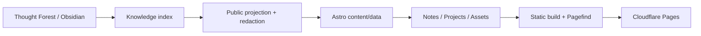

# Digital Biome

> **Personal digital garden, project portfolio, and living infrastructure map.**

<p align="left">
  <strong>Language:</strong> English · <a href="./docs/zh-CN/README.md">Simplified Chinese</a>
</p>

<p align="left">
  <a href="https://bakersean.top"><strong>Live Site</strong></a> ·
  <a href="https://bakersean168.github.io/digital-biome/"><strong>Project Page</strong></a> ·
  <a href="./docs/architecture.md"><strong>Architecture</strong></a> ·
  <a href="https://github.com/BakerSean168/thought-forest"><strong>Thought Forest</strong></a>
</p>

Digital Biome is my personal digital space. It brings together a knowledge garden, project portfolio, resume, digital assets, and infrastructure visualization in one site. Content is not manually copied into the frontend: Thought Forest acts as the canonical knowledge source, and a synchronization, redaction, indexing, and build pipeline projects the public subset onto the web.

It is both an Astro website and an engineering project about turning personal knowledge and technical practice into long-lived, maintainable digital assets.

## What lives here

- **Knowledge garden** — Obsidian / Thought Forest notes, tags, wikilinks, backlinks, and full-text search.
- **Project portfolio** — projects are presented through the problem they solve, their product loop, and engineering highlights, with direct links to GitHub, the project page, and the live product.
- **About / Resume** — personal profile, GitHub activity, resume, and continuous learning history.
- **Infrastructure atlas** — visualization of public assets, hosts, networks, and service relationships while preserving private/internal boundaries.
- **Observability** — a browsable view of long-running personal services and digital assets.

## Content architecture



The repository pins Thought Forest as a Git submodule for reproducible builds. During development, content is regenerated through the same indexing and synchronization pipeline used by CI rather than edited inside generated `src/data` output.

## Project showcase model

The `/dev` page consumes **public `asset_type: project` records** from Thought Forest. A featured project can expose three destinations with distinct responsibilities:

1. **Live** — the real production application.
2. **Project Page** — a lightweight GitHub Pages introduction focused on product story and engineering highlights.
3. **GitHub** — source code, documentation, history, and engineering evidence.

This keeps deployed services, source repositories, and portfolio presentation separate instead of treating them as the same asset.

## Tech stack

- **Framework:** Astro 5
- **Language:** TypeScript
- **Styling:** Tailwind CSS 4
- **Search:** Pagefind
- **Content source:** Obsidian + Thought Forest
- **Deployment:** Cloudflare Pages + Pages Functions
- **Access boundary:** Cloudflare Access for protected surfaces
- **Automation:** GitHub Actions + Wrangler

## Quick start

### Prerequisites

- Node.js 22+
- pnpm 10+
- Git with submodule support

### Local development

```bash
git clone --recurse-submodules https://github.com/BakerSean168/digital-biome.git
cd digital-biome
pnpm install
cp .env.example .env
pnpm dev
```

Useful commands:

```bash
pnpm sync               # rebuild Thought Forest indexes and sync content
pnpm check              # Astro type/content checks
pnpm check:edge         # Pages Functions typecheck
pnpm test:unit
pnpm test:edge
pnpm test:infrastructure
pnpm build              # sync + Astro + Pagefind + postbuild
```

## Repository structure

```text
src/
├── pages/              Astro routes
├── components/         project, asset, note and dashboard UI
├── data/               generated public content/index projection
├── domain/             note routing and foundation rules
├── repositories/       asset / knowledge index access
└── view-models/        presentation adapters

functions/              Cloudflare Pages Functions
scripts/                sync, index, deployment and validation tooling
thought-forest/         pinned knowledge-source submodule
docs/                   architecture and operations documentation
```

## Production & deployment

The live site is **[bakersean.top](https://bakersean.top)** and is deployed on Cloudflare Pages.

Production deployment includes a deliberate public/private boundary: public static content is generated during build, while protected `/api/private/*` capabilities are handled by Pages Functions and Cloudflare Access. The deployment workflow uses explicit production approval and Wrangler direct upload rather than letting an implicit Git integration become the source of truth.

Read:

- [`docs/architecture.md`](./docs/architecture.md) — current system architecture.
- [`docs/cloudflare-deployment.md`](./docs/cloudflare-deployment.md) — Cloudflare deployment contract.
- [`docs/development-deployment-operations.md`](./docs/development-deployment-operations.md) — development and production operations.
- [`docs/asset-architecture.md`](./docs/asset-architecture.md) — asset model and visibility boundary.

## Relationship with Thought Forest

Thought Forest owns the canonical knowledge and asset metadata; Digital Biome owns the public presentation and runtime behavior.

That separation is intentional:

- knowledge remains usable from Obsidian even without the website;
- the website can rebuild from a pinned knowledge revision;
- private/internal asset metadata can stay out of public output;
- project cards can evolve without duplicating project facts in frontend code.

## Repository status & license

Digital Biome is a **public source repository**, but it currently does **not** include an open-source license. Public visibility alone does not grant permission to copy, modify, or redistribute the code; copyright remains with the repository owner unless a license is added later.
