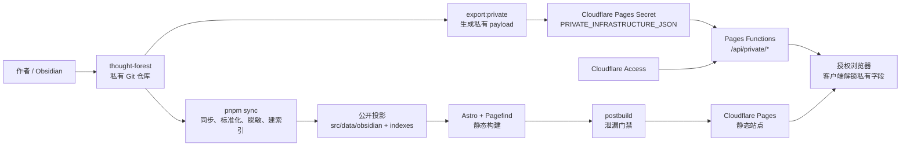

# Digital Biome 系统架构

> 状态基线：2026-07-18
> 本文描述当前已经运行在生产环境中的真实架构，同时明确尚未解决的问题。它不是理想化设计稿。

## 1. 系统定位

Digital Biome 是一个由私有 Obsidian 知识库生成的 Astro 静态站点。系统同时包含两类数据：

- 可公开发布的知识笔记、索引、标签、双链和展示型资产信息；
- 只允许授权用户读取的基础设施 IP、SSH 地址和内部入口。

因此，系统不是单纯的静态博客，而是“私有内容源 + 构建期公开投影 + 少量边缘私有 API”的混合架构。

## 2. 当前系统上下文



系统的关键思想是：原始知识库不直接发布，构建流程只生成公开投影；真实基础设施值不进入静态产物，而由受 Access 保护的 Pages Functions 在运行时返回。

## 3. 分层与职责

### 3.1 内容源层

| 位置 | 职责 | 是否进入公开构建 |
|---|---|---|
| `thought-forest/z/` | 普通知识笔记 | 经同步、过滤和脱敏后进入 |
| `thought-forest/assets/` | 资产笔记及媒体 | 元数据经脱敏后进入；媒体复制到公开目录 |
| `thought-forest/config/` | Dashboard、技能和运维配置 | 可参与构建，但 `obsidian/config/` 不进入公开知识列表 |
| `thought-forest/generated/knowledge-index/` | 上游完整 YAML 解析结果 | 只在同步阶段读取；私有 URL 会被替换为 `private_ref` |

`thought-forest` 是私有 Git 子模块。`digital-biome` 的单个提交不足以独立完成构建，还需要对应的子模块提交以及上游生成索引。

### 3.2 同步与投影层

入口为 `pnpm sync`，实现位于 `scripts/sync/`：

1. 解析 `notes.config.ts`，确定 vault 和上游索引位置；
2. 扫描笔记、资产笔记和配置目录；
3. 校验 frontmatter 风险并复制媒体；
4. 对全部 Markdown 执行网络标识符脱敏；
5. 对 `private` / `internal` 资产链接移除真实 URL，生成稳定 `private_ref`；
6. 写入 `src/data/obsidian/`；
7. 生成 `src/data/indexes/` 中的 notes、tag、asset 和 link-graph 索引；
8. 在上游索引存在时，合并完整的嵌套资产字段。

以下目录都是生成物并被 Git 忽略：

- `src/data/obsidian/`
- `src/data/indexes/`
- `public/vault-assets/`
- `public/pagefind/`
- `dist/`

### 3.3 查询与渲染层

静态索引通过 `src/repositories/knowledge-index-loader.ts` 导入，列表、标签、反链和资产查询不在运行时扫描 Markdown。

正文由 Astro Content Collection 从 `src/data/obsidian/**/*.md` 加载。公开查询必须过滤：

- `draft: true`；
- `private: true`；
- `visibility: private`；
- `obsidian/config/` 运维配置内容。

### 3.4 静态交付层

Astro 生成 `dist/`，Pagefind 随后生成搜索索引。`scripts/postbuild.ts` 在部署前扫描 HTML、JavaScript、JSON 和 Pagefind 文件：

- 检查源 vault 中应脱敏的完整 IPv4；
- 检查上游资产索引中的受保护 URL；
- 若构建环境提供了 `PRIVATE_INFRASTRUCTURE_JSON`，同时检查其中全部值；
- 发现命中即让构建失败。

这道门禁用于防止“页面看起来已遮罩，但敏感值仍留在 HTML、脚本或搜索索引中”。

### 3.5 私有运行时层

`public/_routes.json` 只让 `/api/private/*` 调用 Pages Functions，静态页面不会无意义地消耗 Functions 请求。

```text
/api/private/session          验证登录态，只返回 authenticated=true
/api/private/infrastructure   返回版本化私有 payload
/api/private/enter            安全地跳转回站内路径
```

请求具有两道鉴权：

1. Cloudflare Access 在边缘根据 Allow Policy 拦截未登录或未授权身份；
2. `functions/api/private/_middleware.ts` 再验证 `Cf-Access-Jwt-Assertion` 的签名、issuer、audience、有效期和应用 token 类型。

第二道校验不能省略。Cloudflare 官方也要求源站验证 Access JWT，而不是只相信请求头存在。

### 3.6 客户端解锁层

公开 HTML 中只存在遮罩文本和 `data-private-value` / `data-private-link` 引用。浏览器加载后，`PrivateInfrastructureUnlock.astro` 请求私有 API，并按 `private_ref` 将真实值填入 DOM。

这保证了：

- 未登录用户和搜索引擎只能看到遮罩；
- 静态缓存和 Pagefind 不含真实值；
- 授权用户在浏览器中仍能查看并使用真实入口。

它不保证授权用户无法复制数据。浏览器一旦解锁，授权用户就拥有这些值，这是当前单用户信任模型的一部分。

## 4. 信任边界与数据分类

| 数据 | 存储位置 | 可见范围 | 主要保护手段 |
|---|---|---|---|
| 公开笔记正文 | Pages 静态文件 | 互联网 | 发布过滤 |
| 公开资产元数据 | 静态 JSON/HTML | 互联网 | 上游契约与 schema |
| 私有/内部链接 | Pages Secret | Access 授权用户 | Access + JWT 二次校验 |
| IP、SSH URL | 私有 vault、Pages Secret | 作者和授权用户 | 私有仓库、脱敏、泄漏门禁 |
| Access AUD、团队域 | Pages Secret | Pages Functions | Cloudflare Secret |
| 原始 vault | GitHub 私有仓库 | GitHub 授权主体 | 仓库权限 |

禁止把任何私有值放入以下位置：

- `PUBLIC_*` 环境变量；
- `wrangler.jsonc`；
- Astro 页面 frontmatter 或客户端脚本常量；
- GitHub Actions 日志；
- README、截图、测试 fixture 或提交信息。

## 5. 部署拓扑与当前决策

Cloudflare Pages 项目仍与 `digital-biome` Git 仓库关联，但生产和预览自动构建均已关闭。生产发布由 GitHub Actions 使用锁定的两个仓库提交执行：

```text
main SHA + private Vault SHA
                ↓
 build/check/index/leak scan
                ↓
 production Environment approval
                ↓
 Secret update + Wrangler Direct Upload
                ↓
        Cloudflare Pages main
```

原因是 Cloudflare Git 克隆无法把凭据传给私有 `thought-forest` 子模块。GitHub Actions 则能用限定两个仓库的短期 GitHub App token 完成检出，并在批准后使用 Wrangler 部署。Cloudflare 官方支持在 Git 集成项目中关闭自动部署后继续使用 Wrangler 创建部署。

## 6. 已知架构问题

### 6.1 已缓解：部署不再依赖单个本地工作区

日常生产路径已迁移到 `.github/workflows/deploy-cloudflare-pages.yml`，以主仓库 SHA、Vault SHA 和资产索引 hash 固定输入。本地 `pnpm deploy:cloudflare` 仅保留为紧急恢复手段。

剩余外部依赖是 GitHub App、Production Environment 和 Cloudflare API token 的控制面配置。

### 6.2 已缓解：GitHub Actions 私有子模块凭据

相关工作流现在先创建一小时内有效、Contents Read 的 GitHub App installation token，并限定 `digital-biome` 与 `thought-forest`。子模块更新工作流使用当前仓库内置的 `GITHUB_TOKEN` 创建分支和 PR，不向 App 或 Vault 授予写权限。

### 6.3 已缓解：构建输入漂移

`notes.config.ts` 不再搜索仓库外的 `generated/`；`pnpm sync` 会先从当前子模块运行 `kb:index`。生产构建记录并在批准后重新核对主仓库 SHA、Vault SHA 与资产索引 SHA-256。

### 6.4 P1：同一 frontmatter 存在两套解析器

本地 `build-indexes.ts` 使用轻量行扫描，上游索引使用完整 YAML 解析。随后 `merge-asset-index.ts` 再覆盖嵌套字段。这形成双重事实源：

- 简单字段以本地扫描结果为主；
- `monitor`、`links`、`homepage` 等依赖上游索引；
- 两边字段映射和命名规则可能漂移。

长期应共享一个版本化 schema 和同一解析实现，或让上游输出成为唯一索引输入。

### 6.5 已缓解：私有 payload 与部署编排

生产工作流已合并生成、契约验证、索引 hash 核对、Secret 更新、部署与冒烟测试。Cloudflare Pages 仍没有把 Secret 变更与静态部署做成单一原子事务，因此仍可能出现：

- Secret 已更新，但静态部署失败；

稳定 asset ref、契约测试与失败告警降低了该窗口的风险；故障时按部署 manifest 回滚代码，并从对应 Vault SHA 重新生成 Secret。

### 6.6 P1：泄漏检测是已知值扫描，不是完整信息流证明

当前门禁能有效阻止源 vault 中已识别的 IP 和受保护 URL进入产物，但仍存在边界：

- 新类型秘密若不符合 IPv4/受保护链接规则，可能不在候选集合；
- 上游生成索引缺失时，受保护 URL 集合不完整；
- 截图、二进制附件和编码后的值不一定能被文本扫描发现。

因此，内容分类和发布 allowlist 比单纯的 denylist/redaction 更可靠。

### 6.7 P2：授权后返回整包基础设施数据

`/api/private/infrastructure` 当前向任一允许身份返回全部 values 和 links。对于单用户站点这是可接受的最简模型；如果未来增加多用户或共享访问，应按资源、角色或用途拆分权限，避免一个 Access Policy 等同于读取全部基础设施。

### 6.8 P2：Cloudflare 控制面没有完全代码化

Access Application、Allow Policy、Pages Secrets、自动构建开关和 GitHub App 权限主要存在于控制台。`wrangler.jsonc` 只覆盖 Pages 运行配置，无法单独重建整个生产环境。

应逐步引入 Terraform/Pulumi 或至少维护定期导出的配置快照与人工审计清单。

### 6.9 P2：缺少端到端自动验收和告警

当前单元测试覆盖 JWT 规则，但没有自动化验证：

- 未登录自定义域是否被 Access 拦截；
- 直连 `pages.dev` 是否被 Functions 拒绝；
- 允许身份是否能完成解锁；
- Secret key 是否覆盖所有公开 `private_ref`；
- 最新部署失败时是否告警。

## 7. 推荐演进路线

### 阶段 A：先让交付可重复

1. 为 GitHub Actions 配置只能读取 `thought-forest` 的 GitHub App token 或 deploy key；
2. 在 CI 内显式生成上游 knowledge index，不再依赖未版本化的本机 `generated/`；
3. 添加 `release` 工作流：同步 → 检查 → 构建 → 泄漏扫描 → Wrangler 部署 → HTTP 验收；
4. Cloudflare API token 只授予目标账户的 Pages Edit 权限；
5. 生产部署使用 GitHub Environment 审批。

### 阶段 B：收敛内容契约

1. 为 notes、assets、links 建立共享 schema 包；
2. 删除本地行扫描与上游完整解析并存的双解析路径；
3. 让同步在缺少上游关键索引时 fail closed；
4. 为每次公开投影生成 manifest，记录主仓库 SHA、vault SHA、索引版本和敏感值扫描摘要。

### 阶段 C：代码化基础设施

1. 用 Terraform/Pulumi 管理 Access Application、Policy 和 Pages 配置；
2. 采用短期凭据或 CI 专用 Secret 管理方式；
3. 为 Access 拒绝、Functions 5xx 和部署失败建立告警；
4. 定期测试回滚和 Secret 轮换。

## 8. 当前不建议做的事

- 不要为了恢复 Cloudflare Git 自动构建而重新公开 `thought-forest`；
- 不要把 vault 直接复制进 `digital-biome` 主仓库；
- 不要把私有 URL 作为构建时 `PUBLIC_*` 变量；
- 不要在缺少上游索引时静默执行生产发布；
- 不要把“页面显示遮罩”当成“静态产物没有泄漏”的证明。

## 9. 关联文档

- [开发、部署与运维手册](development-deployment-operations.md)
- [Cloudflare Pages 部署与 Access 配置](cloudflare-deployment.md)
- [笔记同步与公开投影流程](notes-sync-process.md)
- [ADR-0001：私有 Vault 与 Pages 直接部署](adr/0001-private-vault-direct-pages-deployment.md)
- [资产架构设计](asset-architecture.md)
- [设计系统：Basalt & Moss](design-system-basalt-and-moss.md)

## 10. 官方参考

- [Cloudflare Pages Git integration](https://developers.cloudflare.com/pages/configuration/git-integration/)
- [Cloudflare Pages Functions routing](https://developers.cloudflare.com/pages/functions/routing/)
- [Validate Cloudflare Access JWTs](https://developers.cloudflare.com/cloudflare-one/access-controls/applications/http-apps/authorization-cookie/validating-json/)
- [Cloudflare Pages Wrangler configuration](https://developers.cloudflare.com/pages/functions/wrangler-configuration/)
