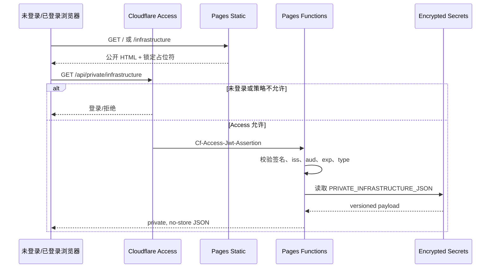

# Cloudflare Pages、Functions 与 Access 配置

> 当前生产模式：Git 集成保留，但自动 Production/Preview deployments 均关闭；发布通过 Wrangler 完成。完整日常流程见 [开发、部署与运维手册](development-deployment-operations.md)。

## 1. 运行拓扑



## 2. Pages 项目配置

| 项 | 值 |
|---|---|
| Project | `digital-biome` |
| Production branch | `main` |
| Output directory | `dist` |
| Node | 24.x (`.node-version`) |
| Wrangler config | `wrangler.jsonc` |
| Functions routes | `/api/private/*` |
| Automatic production deployments | Disabled |
| Automatic preview deployments | None |

`wrangler.jsonc` 是 Pages 运行配置的版本控制入口，但 Access Policy、Secrets 和 GitHub App 权限仍位于外部控制面。

## 3. Functions 路由

`public/_routes.json`：

```json
{
  "version": 1,
  "include": ["/api/private/*"],
  "exclude": []
}
```

该文件必须进入最终 `dist/`。Functions 目录位于仓库根目录，不能移入 `dist/`。

## 4. Cloudflare Access Application

创建 Self-hosted Application：

```text
Application name: digital-biome private API
Domain: bakersean.top
Path: /api/private/*
```

策略要求：

- 默认拒绝；
- Allow Policy 只包含明确身份；
- 不使用 Everyone 或长期 Bypass；
- AUD 从 Application Additional settings 获取；
- 修改或重建 Application 后同步检查 `CF_ACCESS_AUD`。

## 5. Pages Secrets

仅保留：

| Secret | 用途 |
|---|---|
| `CF_ACCESS_TEAM_DOMAIN` | JWKS issuer 与证书地址，例如团队 `cloudflareaccess.com` 域 |
| `CF_ACCESS_AUD` | 绑定当前 Access Application |
| `PRIVATE_INFRASTRUCTURE_JSON` | 版本化真实 values/links |

这些值必须是 encrypted secrets，不能是 plaintext build variables 或 `PUBLIC_*`。

列出名称：

```bash
pnpm exec wrangler pages secret list --project-name digital-biome
```

生成私有 payload：

```bash
pnpm sync
pnpm export:private -- --out tmp/private-infrastructure.json
```

更新 Secret 后必须重新部署，Pages 的新部署才会使用一致的配置版本。

## 6. JWT 纵深校验

Cloudflare Access 是外层策略，`edge/access.ts` 是源站校验。中间件验证：

- `Cf-Access-Jwt-Assertion` 存在；
- RS256 签名来自团队 JWKS；
- issuer 等于规范化 team domain；
- audience 等于 Pages Secret 中的 AUD；
- `email`、`sub`、`iat`、`exp`、`type` 必需；
- `type` 必须是 `app`。

无 token 或 token 无效返回 `401`；配置缺失/非法返回 `500`。错误响应和日志不返回 token、email 或 Secret 内容。

## 7. 私有 payload 契约

```json
{
  "version": 1,
  "values": {
    "stable.key": "private display value"
  },
  "links": {
    "asset-id.links.kind": "https://private.example.test"
  }
}
```

约束：

- key 只能使用小写字母、数字、点、下划线和连字符；
- value 非空且长度受限；
- link 只允许 `http:`、`https:`、`ssh:`；
- exporter 与公开索引共用 `edge/private-refs.ts`；
- API 响应使用 `Cache-Control: private, no-store`。

## 8. 构建与部署

生产发布入口是 `.github/workflows/deploy-cloudflare-pages.yml`。`main` 更新后先在无 Cloudflare 凭据的 build job 中完成：

1. 用短期 GitHub App token 检出主仓库与锁定的私有 Vault；
2. 从该 Vault SHA 生成 knowledge index；
3. 执行 Astro、Pages Functions、edge 和基础设施契约检查；
4. 生成 Pagefind 并执行泄漏扫描；
5. 保存 `dist/`、主仓库 SHA、Vault SHA 和资产索引 hash。

随后 `production` Environment 阻断 deploy job。批准后才会读取 Cloudflare Secrets，重新生成同一 Vault SHA 的私密 payload、核对资产索引 hash、更新 `PRIVATE_INFRASTRUCTURE_JSON`、上传已审查的 `dist/` 与 Functions，并执行未登录冒烟测试。

首次启用前必须配置：

| 位置 | 名称 | 最小用途 |
|---|---|---|
| Repository variable | `VAULT_APP_CLIENT_ID` | 创建短期 GitHub App token |
| Repository secret | `VAULT_APP_PRIVATE_KEY` | GitHub App 私钥 |
| Production secret | `CLOUDFLARE_ACCOUNT_ID` | 目标 Cloudflare 账户 |
| Production secret | `CLOUDFLARE_API_TOKEN` | 仅目标账户 Cloudflare Pages Edit |
| Production variable | `PRODUCTION_URL` | 部署后的自定义域冒烟测试 |

GitHub App 只安装到 `digital-biome` 与 `thought-forest`，且只授予 Contents Read。子模块更新分支和 PR 使用当前仓库内置的 `GITHUB_TOKEN`（Contents Write、Pull requests Write），不把 Vault 写权限交给 App；仓库还需允许 GitHub Actions 创建 PR。`production` Environment 应限制为 `main`，并在当前 GitHub 套餐支持时启用 required reviewer 与禁止 self-review。

本地命令保留用于开发验证和紧急人工恢复：

```bash
pnpm sync
pnpm check
pnpm check:edge
pnpm test:edge
pnpm build:only
pnpm exec wrangler pages deploy dist --project-name digital-biome --branch main
```

或使用整合命令：

```bash
pnpm deploy:cloudflare
```

Cloudflare 官方允许在 Git 集成项目中关闭自动构建，然后继续使用 Wrangler 创建直接部署。当前项目采用 GitHub Actions + Wrangler Direct Upload，以保持私有子模块不公开且消除日常发布对个人电脑的依赖。

## 9. 验收矩阵

| 场景 | 自定义域 | `pages.dev` 直连 | 页面结果 |
|---|---|---|---|
| 未登录 | Access 登录/拒绝 | Functions `401` | 保持遮罩 |
| 不允许身份 | Access 拒绝 | Functions `401` | 保持遮罩 |
| 允许身份 | Access 通过 + JWT 有效 | 取决于是否有有效 assertion | 字段和链接解锁 |
| Secret 配置错误 | Access 通过 | Functions `500` | 保持遮罩 |
| payload key 缺失 | API 可成功 | API 可成功 | 对应字段仍锁定 |

生产验收必须同时覆盖外层 Access 和内层 Functions，不能只测试其中一个。

## 10. 为什么禁用 Cloudflare Git 自动构建

`thought-forest` 是私有子模块。实际验证中，Cloudflare Git 构建可以克隆 `digital-biome`，但对子模块执行 update 时没有可用 GitHub 凭据，即使 Cloudflare GitHub App 同时获得两个仓库权限，仍失败于：

```text
fatal: could not read Username for 'https://github.com'
```

当前处理：

- `thought-forest` 保持私有；
- 专用 GitHub App 向 GitHub Actions 提供一小时内有效、限定两个仓库的 token；
- Cloudflare Production/Preview 自动部署关闭；
- 由受保护的 `production` Environment 批准后运行 Wrangler Direct Upload。

不要通过公开 vault 或把 token 写入 `.gitmodules` 来恢复自动构建。

## 11. 回滚与故障处理

Pages 控制台支持将 Production 回滚到任一历史成功部署。回滚后仍需单独核对 Secrets 和 Access，因为它们不随静态 deployment 一起回滚。

故障定位顺序：

1. Pages deployment 状态；
2. Functions 日志事件；
3. Access Policy 与 AUD；
4. Secret 名称和 payload schema；
5. 页面 `private_ref` 覆盖率；
6. 静态泄漏门禁输出。

## 12. 官方参考

- [Cloudflare Pages Git integration](https://developers.cloudflare.com/pages/configuration/git-integration/)
- [Branch deployment controls](https://developers.cloudflare.com/pages/configuration/branch-build-controls/)
- [Pages Direct Upload](https://developers.cloudflare.com/pages/get-started/direct-upload/)
- [Pages Functions routing](https://developers.cloudflare.com/pages/functions/routing/)
- [Validate Access JWTs](https://developers.cloudflare.com/cloudflare-one/access-controls/applications/http-apps/authorization-cookie/validating-json/)
- [Pages rollbacks](https://developers.cloudflare.com/pages/configuration/rollbacks/)
