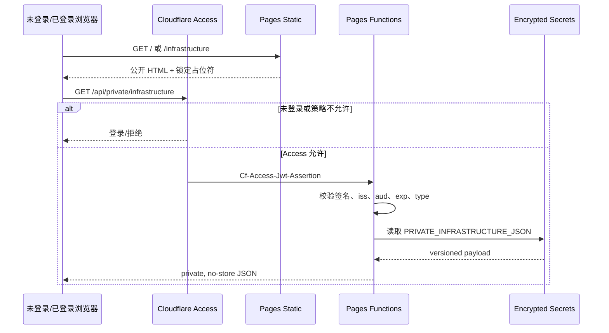

# Cloudflare Pages、Functions 与 Access 配置

> 当前生产模式：Git 集成保留，但自动 Production/Preview deployments 均关闭；发布通过 Wrangler 完成。完整日常流程见 [开发、部署与运维手册](development-deployment-operations.md)。

## 1. 运行拓扑


```mermaid
sequenceDiagram
  participant U as 未登录/已登录浏览器
  participant A as Cloudflare Access
  participant P as Pages Static
  participant F as Pages Functions
  participant S as Encrypted Secrets

  U->>P: GET / 或 /infrastructure
  P-->>U: 公开 HTML + 锁定占位符
  U->>A: GET /api/private/infrastructure
  alt 未登录或策略不允许
    A-->>U: 登录/拒绝
  else Access 允许
    A->>F: Cf-Access-Jwt-Assertion
    F->>F: 校验签名、iss、aud、exp、type
    F->>S: 读取 PRIVATE_INFRASTRUCTURE_JSON
    S-->>F: versioned payload
    F-->>U: private, no-store JSON
  end
```

## 2. Pages 项目配置

| 项                               | 值                                              |
| -------------------------------- | ----------------------------------------------- |
| Project                          | `digital-biome`                                 |
| Production branch                | `main`                                          |
| Output directory                 | `dist`                                          |
| Node                             | 24.x (`.node-version`)                          |
| Wrangler config                  | `wrangler.jsonc`                                |
| Functions routes                 | `/api/*` plus `/notes/obsidian/*` source routes |
| Automatic production deployments | Disabled                                        |
| Automatic preview deployments    | None                                            |

`wrangler.jsonc` 是 Pages 运行配置的版本控制入口，但 Access Policy、Secrets 和 GitHub App 权限仍位于外部控制面。

## 3. Functions 路由

`public/_routes.json` 当前覆盖公开 API 路由：

```json
{
  "version": 1,
  "include": ["/api/*"],
  "exclude": []
}
```

开发源码仍位于仓库根目录 `functions/`。Candidate 阶段通过 `wrangler pages functions build` 将它编译为 `dist/_worker.js` 并生成最终 `dist/_routes.json`；Release 与 Production 只携带/上传这个已构建结果，不在部署时重新编译 Functions。

## 4. Cloudflare Access Application

创建 Self-hosted Application：

```text
Application name: digital-biome private API
Domain: bakersean.top
Path: /api/private/*
```

策略要求：

- 默认拒绝；
- Allow Policy 只包含明确身份；
- 不使用 Everyone 或长期 Bypass；
- AUD 从 Application Additional settings 获取；
- 修改或重建 Application 后同步检查 `CF_ACCESS_AUD`。

## 5. Pages Secrets

仅保留：

| Secret                        | 用途                                                       |
| ----------------------------- | ---------------------------------------------------------- |
| `CF_ACCESS_TEAM_DOMAIN`       | JWKS issuer 与证书地址，例如团队 `cloudflareaccess.com` 域 |
| `CF_ACCESS_AUD`               | 绑定当前 Access Application                                |
| `PRIVATE_INFRASTRUCTURE_JSON` | 版本化真实 values/links                                    |

这些值必须是 encrypted secrets，不能是 plaintext build variables 或 `PUBLIC_*`。

列出名称：

```bash
pnpm exec wrangler pages secret list --project-name digital-biome
```

生成私有 payload：

```bash
pnpm sync
pnpm export:private -- --out tmp/private-infrastructure.json
```

更新 Secret 后必须重新部署，Pages 的新部署才会使用一致的配置版本。

## 6. JWT 纵深校验

Cloudflare Access 是外层策略，`edge/access.ts` 是源站校验。中间件验证：

- `Cf-Access-Jwt-Assertion` 存在；
- RS256 签名来自团队 JWKS；
- issuer 等于规范化 team domain；
- audience 等于 Pages Secret 中的 AUD；
- `email`、`sub`、`iat`、`exp`、`type` 必需；
- `type` 必须是 `app`。

无 token 或 token 无效返回 `401`；配置缺失/非法返回 `500`。错误响应和日志不返回 token、email 或 Secret 内容。

## 7. 私有 payload 契约

```json
{
  "version": 1,
  "values": {
    "stable.key": "private display value"
  },
  "links": {
    "asset-id.links.kind": "https://private.example.test"
  }
}
```

约束：

- key 只能使用小写字母、数字、点、下划线和连字符；
- value 非空且长度受限；
- link 只允许 `http:`、`https:`、`ssh:`；
- exporter 与公开索引共用 `edge/private-refs.ts`；
- API 响应使用 `Cache-Control: private, no-store`。

## 8. 构建、Release 与部署

完整 contract 见 [Digital-Biome Delivery Lifecycle](delivery-lifecycle.md)。当前不再使用 `main push -> production`：

```text
PR -> CI -> main -> exact-SHA CI -> Candidate -> optional staging

manual Prepare Release -> Release PR -> CI -> merge -> Candidate
  -> Published GitHub Release

manual Deploy Production(vX.Y.Z)
  -> verify Published Release
  -> production Environment gate
  -> promote immutable artifact
```

主要 workflow：

- `.github/workflows/check.yml`：PR/main CI；
- `.github/workflows/candidate-publish.yml`：从 successful exact-SHA main CI 构建 Candidate；
- `.github/workflows/release-please.yml`：手动创建/更新 Release PR；
- `.github/workflows/release-publish.yml`：仅对真正 Release commit 发布 immutable GitHub Release；
- `.github/workflows/deploy-production.yml`：手动选择 Published `vX.Y.Z` 后部署 Production。

Candidate 阶段先验证 committed `knowledge-public-v1` lock 与 immutable producer Release，再完成 Astro/Pagefind 构建和 Pages Functions 编译，并生成带 SHA-256 的 `digital-biome-pages.tar.gz`。Release 只提升该 artifact；Production 使用 `--no-bundle` 上传同一 artifact，因此不会重建应用。

Production 会重新验证 Release manifest 绑定的 `knowledge-public-v1` producer identity，并从 Release SHA 检出同一 Thought Forest source revision 的私有 Vault，用于重新生成私有 payload 和更新 encrypted Pages bindings。legacy v1 rollback Release 才继续执行旧的 private asset-index hash 校验；这些步骤都属于部署配置，不改变已经发布的 public application artifact。

首次启用前必须配置：

| 位置                | 名称                     | 最小用途                              |
| ------------------- | ------------------------ | ------------------------------------- |
| Repository variable | `VAULT_APP_CLIENT_ID`    | 创建短期 GitHub App token             |
| Repository secret   | `VAULT_APP_PRIVATE_KEY`  | GitHub App 私钥                       |
| Repository variable | `STAGING_DEPLOY_ENABLED` | 是否启用 Candidate -> staging preview |
| Staging secret      | `CLOUDFLARE_ACCOUNT_ID`  | staging preview 的 Cloudflare 账户    |
| Staging secret      | `CLOUDFLARE_API_TOKEN`   | staging preview 的 Pages Edit 权限    |
| Production secret   | `CLOUDFLARE_ACCOUNT_ID`  | 目标 Cloudflare 账户                  |
| Production secret   | `CLOUDFLARE_API_TOKEN`   | 仅目标账户 Cloudflare Pages Edit      |
| Production variable | `PRODUCTION_URL`         | 部署后的自定义域冒烟测试              |

GitHub App 只安装到 `digital-biome` 与 `thought-forest`，且只授予 Contents Read。Release Prepare 使用仓库 `GITHUB_TOKEN`，并显式 dispatch Release PR head 的 CI，不要求新增长期 PAT。`production` Environment 应保留审批保护；`staging` Environment 在 Cloudflare 凭据配置完成前保持禁用。

Cloudflare Git 自动 Production/Preview deployments 继续关闭；日常交付由 GitHub Actions + Wrangler Direct Upload 完成。公开 Candidate 只消费 producer-owned projection，私有 gitlink仅在 production/private-payload 路径读取，因此不需要把 Vault 暴露给公开构建系统，同时所有 promotion 都保留可审计 provenance。

## 9. 验收矩阵

| 场景             | 自定义域               | `pages.dev` 直连           | 页面结果       |
| ---------------- | ---------------------- | -------------------------- | -------------- |
| 未登录           | Access 登录/拒绝       | Functions `401`            | 保持遮罩       |
| 不允许身份       | Access 拒绝            | Functions `401`            | 保持遮罩       |
| 允许身份         | Access 通过 + JWT 有效 | 取决于是否有有效 assertion | 字段和链接解锁 |
| Secret 配置错误  | Access 通过            | Functions `500`            | 保持遮罩       |
| payload key 缺失 | API 可成功             | API 可成功                 | 对应字段仍锁定 |

生产验收必须同时覆盖外层 Access 和内层 Functions，不能只测试其中一个。

## 10. 为什么禁用 Cloudflare Git 自动构建

`thought-forest` 是私有子模块。实际验证中，Cloudflare Git 构建可以克隆 `digital-biome`，但对子模块执行 update 时没有可用 GitHub 凭据，即使 Cloudflare GitHub App 同时获得两个仓库权限，仍失败于：

```text
fatal: could not read Username for 'https://github.com'
```

当前处理：

- `thought-forest` 保持私有；
- 专用 GitHub App 向 GitHub Actions 提供一小时内有效、限定两个仓库的 token；
- Cloudflare Production/Preview 自动部署关闭；
- 由受保护的 `production` Environment 批准后运行 Wrangler Direct Upload。

不要通过公开 vault 或把 token 写入 `.gitmodules` 来恢复自动构建。

## 11. 回滚与故障处理

Pages 控制台支持将 Production 回滚到任一历史成功部署。回滚后仍需单独核对 Secrets 和 Access，因为它们不随静态 deployment 一起回滚。

故障定位顺序：

1. Pages deployment 状态；
2. Functions 日志事件；
3. Access Policy 与 AUD；
4. Secret 名称和 payload schema；
5. 页面 `private_ref` 覆盖率；
6. 静态泄漏门禁输出。

## 12. 官方参考

- [Cloudflare Pages Git integration](https://developers.cloudflare.com/pages/configuration/git-integration/)
- [Branch deployment controls](https://developers.cloudflare.com/pages/configuration/branch-build-controls/)
- [Pages Direct Upload](https://developers.cloudflare.com/pages/get-started/direct-upload/)
- [Pages Functions routing](https://developers.cloudflare.com/pages/functions/routing/)
- [Validate Access JWTs](https://developers.cloudflare.com/cloudflare-one/access-controls/applications/http-apps/authorization-cookie/validating-json/)
- [Pages rollbacks](https://developers.cloudflare.com/pages/configuration/rollbacks/)
