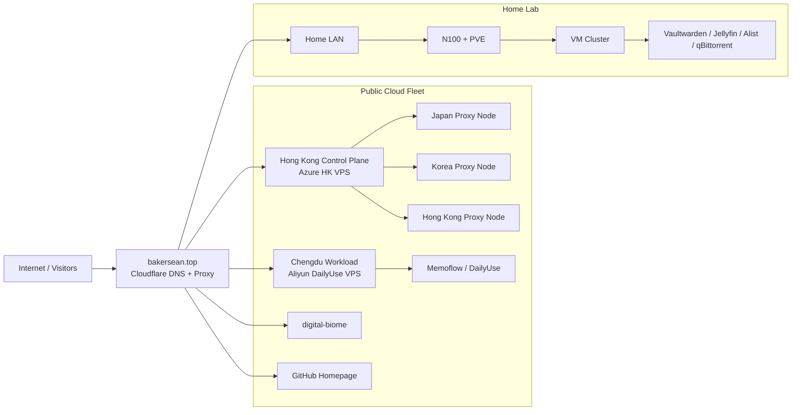
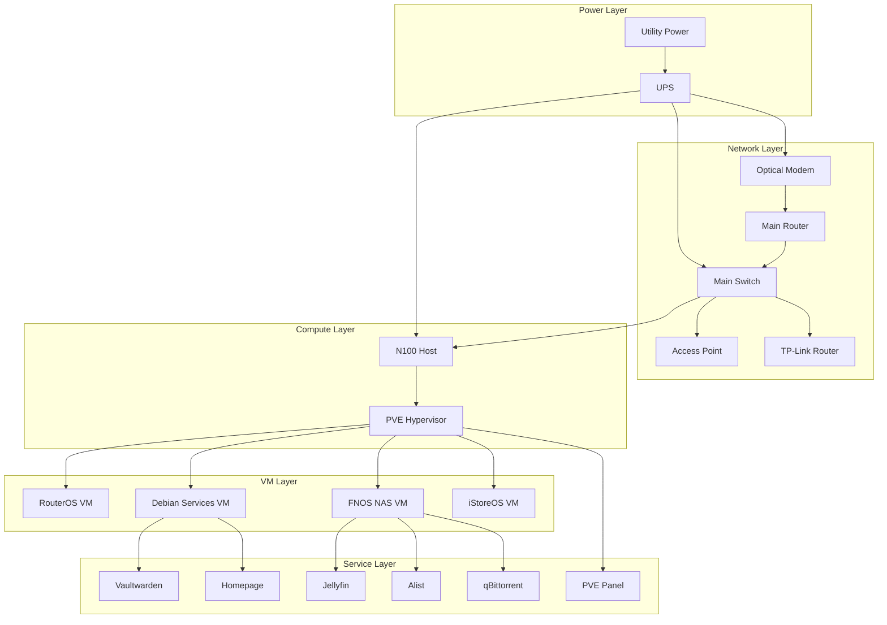
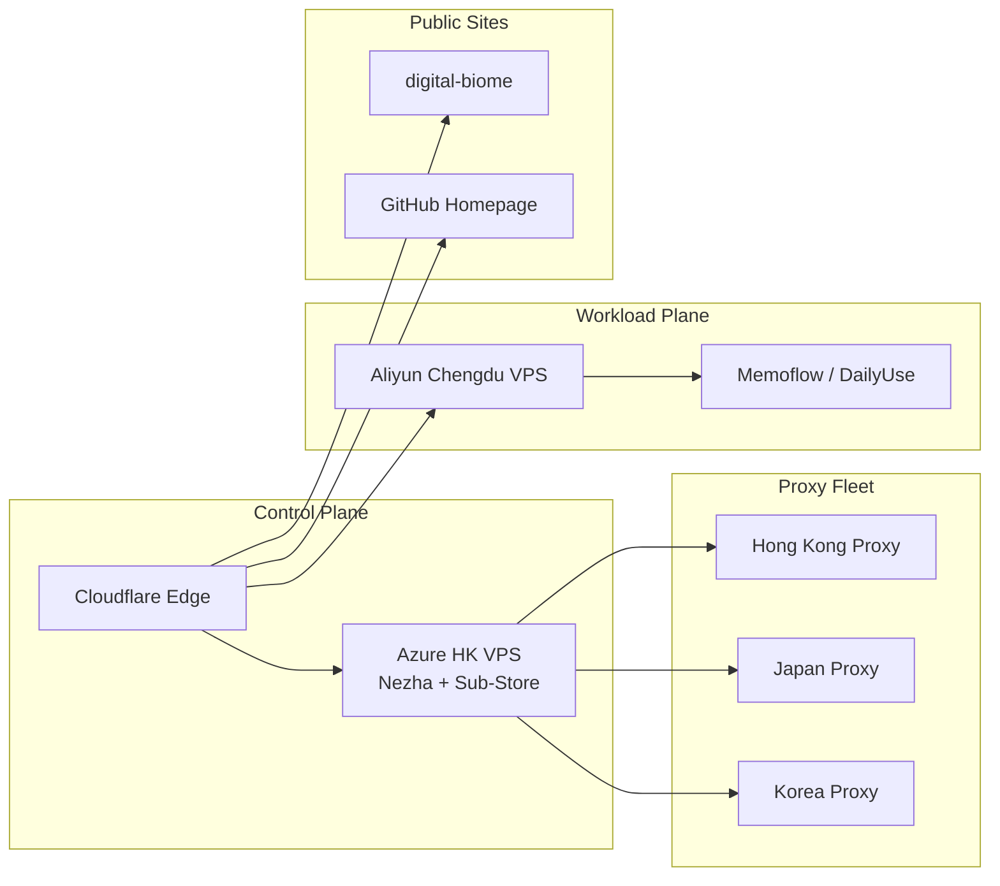

# Digital Biome 基础设施展示页信息架构与视觉方案

## 文档目标

本文档定义 `Digital Biome` 中“基础设施展示部分”的信息架构、视觉语言和图形化表达方式。

目标不是单纯做一张拓扑图，而是把它做成一个完整的“个人基础设施展示站”分区，让访客能够同时感受到：

- `MJJ` 味
- `Homelab` 味
- 个人知识站的完整度

这里的“基础设施展示”覆盖两大域：

- 家庭网络内部
- 公网云 VPS / 公网服务外部

并以统一的站点语言组织它们之间的关系。

## 体验目标

### 1. 让人一眼看懂整体格局

用户进入基础设施页后，第一感觉应该是：

- 这是一个有控制面、有公网节点、有家庭网络的完整个人基础设施体系
- 不是零散的导航卡片拼贴

### 2. 让不同背景的人都能找到入口

不同访客关注点不同：

- 技术爱好者会先看拓扑和节点分布
- `MJJ` 圈层用户会先看地区、厂商、线路、节点角色
- `Homelab` 用户会先看 PVE、VM、NAS、交换机、UPS、AP
- 普通访客会先看“你这套到底能干嘛”

所以展示必须同时支持：

- 总览
- 分层
- 深挖
- 跳转

### 3. 让图不是插画，而是站点入口

每个图节点都不是摆设，而是可继续进入的资产入口：

- 可查看资产详情
- 可打开服务入口
- 可跳到监控页
- 可关联到知识笔记

## 设计原则

### 1. 一个基础设施站，三种视图

不依赖单一大图承载全部信息，而是拆成三种互补视图：

1. `Global Atlas`
2. `Homelab View`
3. `Fleet View`

三者分别回答不同问题：

- `Global Atlas`：整体世界观是什么
- `Homelab View`：家庭网络内部怎么组织
- `Fleet View`：公网节点如何分布与分工

### 2. 图先讲结构，再讲节点

展示顺序应当是：

1. 先看到整体域划分
2. 再看到链路或层级
3. 最后进入单节点

避免一开始就把用户丢进一堆资产卡或细碎按钮中。

### 3. 风格上混合 MJJ 与 Homelab

#### `MJJ` 味

强调：

- 区域
- 厂商
- 节点角色
- 面板 / 探针 / 代理 / 分发
- 公网服务入口

#### `Homelab` 味

强调：

- 电源层
- 网络层
- 宿主层
- 虚拟化层
- 服务层

### 4. 同一资产，多重投影

同一份资产笔记，需要在站点中投影为多种视图对象：

- 列表卡片
- 图节点
- 详情页
- 监控跳板

这样既保证数据统一，也保证展示灵活。

## 页面信息架构

建议基础设施分区最终形成以下页面结构：

```text
/infrastructure
/infrastructure/homelab
/infrastructure/fleet
/infrastructure/[assetId]
```

### 1. `/infrastructure`

站点中的“基础设施总览页”。

职责：

- 展示整体世界观
- 说明公网与家庭网络如何连接
- 引导进入更细分的两张大图

内容结构建议：

1. 顶部 Hero
2. `Global Atlas` 总览图
3. `Homelab` 摘要模块
4. `Fleet` 摘要模块
5. 关联资产入口

### 2. `/infrastructure/homelab`

专门承接家庭网络内部展示。

职责：

- 展示家里网络结构
- 展示电源与网络骨架
- 展示 PVE、VM 和服务展开

内容结构建议：

1. 家庭网络简介
2. 家庭网络分层图
3. 设备清单
4. VM 清单
5. 服务清单

### 3. `/infrastructure/fleet`

专门承接公网节点与外部服务展示。

职责：

- 展示区域分布
- 展示节点角色
- 展示控制面、业务面、代理面

内容结构建议：

1. 公网舰队概览
2. 区域节点矩阵
3. 控制面模块
4. 业务面模块
5. 代理节点模块

### 4. `/infrastructure/[assetId]`

资产细节页。

职责：

- 提供稳定事实
- 给出入口、监控、上下文
- 连接知识笔记与其他资产

## 模块设计

### A. Hero 区

基础设施页顶部应当更像“控制台封面”，而不是普通内容页头。

推荐信息：

- 标题：`Personal Infrastructure Atlas`
- 副标题：一句话解释这套体系
- 事实徽章

事实徽章建议：

- 公网区域数
- 在线节点数
- 家庭核心设备数
- 已资产化服务数

### B. Global Atlas

这是总览图，不需要塞进全部细节。

它只讲三件事：

- 域名和入口控制
- 公网节点分布
- 家庭网络内部归宿

建议把整体划成三个区块：

- `Public Cloud`
- `Control Plane`
- `Home Lab`

### C. Homelab View

建议从“链路图”升级为“分层图”。

层级推荐如下：

1. `Power Layer`
2. `Network Layer`
3. `Compute Layer`
4. `VM Layer`
5. `Service Layer`

这一页是 `Homelab` 气质的核心来源。

### D. Fleet View

建议从“流程链”升级为“区域节点矩阵”。

每个区域是一列或一组卡片：

- 成都
- 香港
- 日本
- 韩国

每张节点卡固定显示：

- 区域
- 厂商
- 节点类型
- 承载服务
- 入口按钮
- 监控按钮

这一页是 `MJJ` 气质的核心来源。

## 视觉方案

## 总体气质

整体视觉方向建议定义为：

`Infra Editorial + Control Panel Hybrid`

含义：

- 既像一份被认真整理过的技术档案
- 又像一个能直接进入服务的控制台

### 颜色

不建议走纯黑终端风，也不建议走轻博客白底风。

推荐方向：

- 深色基底
- 低对比网格背景
- 节点色彩按类型区分

颜色语义建议：

- `external`：Sky
- `network`：Cyan
- `host`：Emerald
- `hypervisor`：Violet
- `vm`：Amber
- `service`：Lime
- `tool`：Fuchsia

你现在 `InfrastructureAtlas.astro` 里这套配色基础是对的，可以继续深化，而不是推翻。

### 背景

推荐引入更明显但克制的基础设施感背景：

- 微弱网格
- 角落径向辉光
- 轻噪点或低透明度数据面板纹理

目标是让页面有“控制台氛围”，但不压过正文和节点。

### 卡片风格

建议分三类卡片：

1. `Node Card`
   用于图中的设备或服务节点

2. `Region Card`
   用于公网节点矩阵中的地区容器

3. `Fact Card`
   用于展示摘要事实、指标和说明

节点卡应更像“轻面板”：

- 有种类徽章
- 有状态徽章
- 有短描述
- 有固定 CTA

### 字体与文案气质

文案层面应避免过于生活流。

推荐使用偏系统设计 / 基础设施语言：

- `Control Plane`
- `Workload Plane`
- `Home Lab`
- `Power Layer`
- `Network Layer`
- `Compute Layer`
- `Regional Node`
- `Service Entry`

这样能显著增强“完整展示站”的专业感。

## 交互设计

### 1. 节点 hover

hover 时应出现更多“这个节点是什么”的暗示，而不是只有颜色变化。

建议出现：

- 节点角色说明
- 关联资产主键
- 可点击入口提示

### 2. 节点 CTA 固定化

统一按钮语言：

- `资产详情`
- `打开入口`
- `监控页`

避免不同地方出现大量语义漂移按钮。

### 3. 跳转路径统一

图节点跳转优先顺序建议：

1. 详情页
2. 主入口
3. 监控页

这样图仍然是站点内部结构的一部分，而不是纯外链集合。

## 资产映射设计

为了让图形化和笔记体系一致，建议为基础设施展示补充以下投影语义：

### 节点角色

建议新增或规范化这类语义：

- `control-plane`
- `workload`
- `proxy-node`
- `storage`
- `network-core`
- `access-edge`
- `power`

这些不一定要成为新的顶层 `asset_type`，但适合作为标签或 `asset_role` 的下一层扩展。

### 家庭网络层级

建议家庭网络资产明确自己属于哪一层：

- `power`
- `network`
- `compute`
- `virtualization`
- `service`

### 公网节点分面

建议公网节点明确自己属于哪一面：

- `control`
- `business`
- `proxy`
- `showcase`

## 三张 Mermaid 草图

下面三张图不是最终前端样式，而是信息架构和构图草图。

### 1. Global Atlas 总览图



### 2. Homelab View 家庭网络分层图



### 3. Fleet View 公网节点矩阵图



## 分期实施建议

### Phase 1

先把当前 `/infrastructure` 页升级成真正的总览页：

- 加强 Hero
- 收敛 `Global Atlas`
- 加上家庭网络摘要与公网舰队摘要

### Phase 2

新增：

- `/infrastructure/homelab`
- `/infrastructure/fleet`

### Phase 3

强化节点语义和视觉层次：

- 更明显的层级分组
- 更明显的区域卡片
- 更强的节点 hover 与关系线

### Phase 4

如果后续需要，再接更轻量的运行态映射：

- Nezha
- Uptime Kuma
- 外部状态页

但运行态仍然不应反向污染 Obsidian 的稳定事实。

## 最终效果判断标准

如果这个分区设计是成功的，访客应该能在几十秒内形成以下认知：

- 你有一套完整的个人基础设施
- 这套体系分成公网控制面、业务面和家庭网络内部
- 家庭网络不是玩具，而是有分层和编排的 `Homelab`
- 公网节点不是零散机器，而是有区域和角色分工的 `Fleet`
- 这些图都能继续点进去，不只是展示图

这时它就不再像“加了拓扑图的个人博客”，而更像一个真正完成度很高的个人基础设施展示站。
