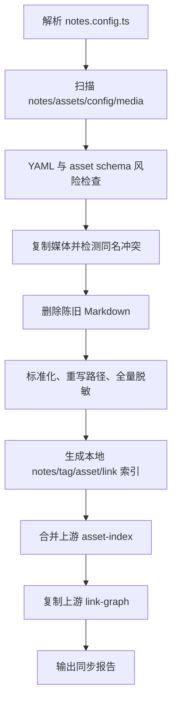

# 笔记同步与公开投影流程

> 状态基线：2026-07-18
>
> 入口：`pnpm sync`
>
> 实现：`scripts/sync-obsidian.ts` 与 `scripts/sync/`

## 1. 目标

同步流程不是简单复制文件。它负责把私有 `thought-forest` vault 转换为可发布的公开投影：

- 收集知识笔记、资产笔记、配置和媒体；
- 校验并标准化 Markdown/frontmatter；
- 重写 Obsidian 媒体路径；
- 删除陈旧生成物；
- 过滤 private/draft/运维内容；
- 脱敏网络标识符和受保护链接；
- 生成静态查询索引；
- 融合上游完整 YAML 解析结果。

## 2. 路径映射

实际路径以 `notes.config.ts` 为准：

| 输入 | 输出 | 说明 |
|---|---|---|
| `thought-forest/z/**/*.md` | `src/data/obsidian/**/*.md` | 普通知识笔记 |
| `thought-forest/assets/**/*.md` | `src/data/obsidian/assets/**/*.md` | host/service/tool/network 资产笔记 |
| `thought-forest/config/**/*.md` | `src/data/obsidian/config/**/*.md` | 构建配置；不进入公开知识列表 |
| `thought-forest/assets/**` 媒体 | `public/vault-assets/` | 公开静态资源 |
| 上游 `generated/knowledge-index/*.json` | `src/data/indexes/*.json` | 合并/替换后的查询索引 |

`src/data/obsidian/`、`src/data/indexes/` 和 `public/vault-assets/` 都是 Git 忽略的生成物。

## 3. 上游索引解析顺序

`notes.config.ts` 默认只读取当前所选 vault root 下的 `generated/`。默认 vault
是仓库中的 `thought-forest` 子模块；若开发者显式设置 `NOTES_VAULT_ROOT`，索引
也随该 vault 移动。`NOTES_UPSTREAM_GENERATED` 仅作为明确的开发覆盖项，不会
自动搜索父目录、相邻克隆或其他工作区。

`pnpm sync` 会先在当前子模块执行 `kb:index`，因此正常本地和 CI 构建都使用与
锁定 Vault SHA 一致的索引。生产发布前必须确认：

```text
<resolved-generated>/knowledge-index/asset-index.json
<resolved-generated>/knowledge-index/link-graph.json
```

均存在且来自预期 vault 提交。

## 4. 执行阶段



### 4.1 扫描与校验

`source-adapter.ts` 根据 include/exclude 规则收集 Markdown。校验会报告：

- YAML 引号、frontmatter 边界等风险；
- asset schema 风险；
- 子模块指针与工作区状态风险。

### 4.2 媒体复制

`asset-transform.ts` 将媒体复制到 `public/vault-assets/`，并处理 Obsidian 嵌入语法和路径。

当前同 basename 冲突采用 last-wins，并在 dry-run 时生成 `reports/media-collisions.json`。这不是理想状态；发现冲突应在源 vault 重命名文件。

### 4.3 Markdown 转换与隐私处理

同步会对全部 Markdown 执行网络标识符处理，而不是只处理资产笔记：

- 对不在保留规则中的 IPv4 进行遮罩；
- 从上游 asset-index 收集 `private` / `internal` URL；
- 受保护链接不写入公开索引，只保留 `private_ref`；
- 保留公开文档示例地址时必须使用 RFC 文档网段或测试域名。

公开链接和私有链接的判断以 `visibility` 为准。不要依赖 URL 长得像内网地址来推断隐私等级。

### 4.4 本地索引

`build-indexes.ts` 生成：

- `notes-index.json`；
- `tag-index.json`；
- `asset-index.json`；
- `link-graph.json`。

这些索引供 `src/repositories/` 静态导入，避免页面构建反复扫描全部 Markdown。

### 4.5 上游融合

本地轻量 frontmatter 扫描不能完整解析嵌套 YAML，所以 `merge-asset-index.ts` 从上游索引覆盖：

- `monitor`；
- `links`；
- `homepage`；
- `asset_role`；
- `host_asset_id`；
- `parent_asset_id`。

受保护 link 在覆盖前通过 `edge/private-refs.ts` 转换，真实 URL 被删除。

`copy-upstream-indexes.ts` 用上游 link graph 替换本地简化版本，以获得准确的双链 ID。

## 5. 命令

### 5.1 预览同步

```bash
pnpm sync -- --dry-run
```

不会写入内容和媒体，输出：

- 预计同步 Markdown 数量；
- 陈旧文件数量；
- 媒体数量和冲突；
- YAML/schema 风险；
- 错误与警告。

### 5.2 正常同步

```bash
pnpm sync
```

### 5.3 同步 favicon

```bash
pnpm sync -- --with-favicons
```

favicon 获取会增加网络和时间成本，不应作为每次开发启动的默认步骤。

### 5.4 使用外部 vault/generated

PowerShell：

```powershell
$env:NOTES_VAULT_ROOT = 'D:\path\to\thought-forest'
$env:NOTES_UPSTREAM_GENERATED = 'D:\path\to\thought-forest\generated'
pnpm sync
```

这些变量只应用于当前明确的开发/构建环境，不应写入提交的 `.env`。

## 6. 发布过滤

同步成功不代表所有同步文件都会形成公开路由。查询层还会排除：

- `draft: true`；
- `private: true`；
- `visibility: private`；
- `obsidian/config/` 前缀；
- 资产内容与普通知识列表之间的交叉项。

需要注意：文件已经写入 `src/data/obsidian/` 后，即使不出现在列表，也可能被错误的页面代码读取。因此新增路由必须复用 repository 层的公开过滤器，不能直接裸用 `getCollection('notes')` 构造公共列表。

## 7. 同步后的检查

```bash
pnpm check
pnpm build:only
```

重点检查：

- 同步报告无 error；
- 上游 asset merge 和 link graph copy 没有意外 skip；
- Astro Content Collection 无重复 ID；
- 私有资产 URL 只剩 `private_ref`；
- `postbuild` 泄漏扫描通过；
- Pagefind 没有索引 private/draft/config 内容。

## 8. 常见问题

### 8.1 子模块未初始化

```bash
git submodule update --init --recursive
```

### 8.2 私有子模块认证失败

修复 GitHub 凭据或仓库权限。不要将 access token 写进 `.gitmodules`，也不要临时把 vault 改为公开。

### 8.3 上游索引缺失

先在当前选定的 `thought-forest` 运行知识索引生成命令。开发环境确需读取另一个
已生成目录时，可显式设置 `NOTES_UPSTREAM_GENERATED`；生产工作流不得依赖该覆盖项。

### 8.4 重复 Content ID

确认没有陈旧同步文件；必要时在确认路径后清理 `.astro/` 和生成的 `src/data/obsidian/`，再执行 `pnpm sync`。

### 8.5 媒体冲突

查看 `reports/media-collisions.json`，在上游重命名冲突文件。不要长期依赖 last-wins。

## 9. 关联文档

- [系统架构](architecture.md)
- [开发、部署与运维手册](development-deployment-operations.md)
- [Cloudflare Pages 部署](cloudflare-deployment.md)
