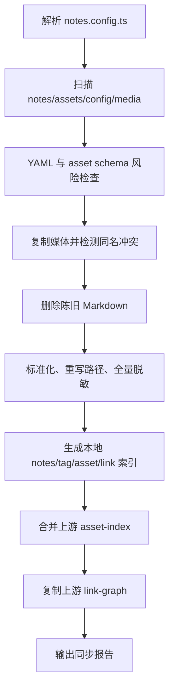

# 笔记同步与公开投影流程

> 状态基线：2026-10-02
>
> CI / Candidate 入口：`scripts/data-products/prepare-knowledge-public-v1.sh`
>
> 本地入口：`pnpm sync`（验证并物化 committed public projection lock）
>
> 实现：`scripts/data-products/`、`scripts/sync-obsidian.ts` 与 `scripts/sync/`

## 1. 目标

同步流程不是简单复制文件。公开边界现在由 Thought Forest 作为 producer 负责：`knowledge-public-v1` 只包含允许公开的笔记、资产、图索引和被引用媒体，并携带精确 source revision。Digital Biome 负责验证并物化这个只读 data product，再生成站点自己的查询索引和页面输入。

CI / Candidate 的主链为：

- 从 `data-products/knowledge-public-v1.lock.json` 读取 immutable producer Release 与 SHA-256；
- 使用短期只读 GitHub App token 下载 `knowledge-public-v1.json` 和 manifest；
- fail-closed 校验 producer、source revision、Release tag、artifact/manifest digest；
- 在 `.pds-runtime/knowledge-public-v1/source/` 物化 legacy-compatible 只读 source；
- 运行现有同步器，重写媒体路径并生成 `src/data` 查询索引；
- Digital Biome 仍保留二次脱敏与泄漏扫描，作为 defense in depth，而不是承担 primary privacy conversion。

Digital Biome 不再内嵌 Thought Forest。`pnpm sync` 与 CI 使用同一 committed lock；本地确需直接联调私有 Thought Forest 时，显式设置 `NOTES_VAULT_ROOT` / `NOTES_UPSTREAM_GENERATED` 指向外部 checkout，再运行 `pnpm sync:content`。

## 2. 路径映射

实际路径以 `notes.config.ts` 为准：

| 输入 | 输出 | 说明 |
|---|---|---|
| `<selected-source>/z/**/*.md` | `src/data/obsidian/**/*.md` | 普通知识笔记 |
| `<selected-source>/assets/**/*.md` | `src/data/obsidian/assets/**/*.md` | host/service/tool/network 资产笔记 |
| `<selected-source>/config/**/*.md` | `src/data/obsidian/config/**/*.md` | 构建配置；不进入公开知识列表 |
| `<selected-source>/sources/attachments/**` | `public/vault-assets/` | producer 允许公开且被引用的媒体 |
| `<selected-source>/generated/knowledge-index/*.json` | `src/data/indexes/*.json` | 合并/替换后的查询索引 |

CI / Candidate 与默认本地同步中的 `<selected-source>` 都是 `.pds-runtime/knowledge-public-v1/source/`；直接私有联调时它可以是显式选择的外部 Thought Forest checkout。

`src/data/obsidian/`、`src/data/indexes/` 和 `public/vault-assets/` 都是 Git 忽略的生成物。

## 3. 上游索引解析顺序

`notes.config.ts` 只读取当前显式选择的 source root 及其 `generated/`，不会自动搜索父目录、相邻克隆或其他工作区。默认值就是已验证的 `.pds-runtime/knowledge-public-v1/source/`；Production private-payload 路径会显式切换到 release-pinned 的临时私有 checkout。

`prepare-knowledge-public-v1.sh` 在物化前先验证 committed lock 与 producer Release；`pnpm sync` 直接调用该入口。私有 producer 的 `kb:index` 只在 Production 临时 checkout 或显式本地私有联调中执行。最终所有模式都向同一 sync pipeline 提供 source layout，但 Digital Biome repository 不拥有该 layout。发布前必须确认：

```text
<resolved-generated>/knowledge-index/asset-index.json
<resolved-generated>/knowledge-index/link-graph.json
```

均存在且来自预期 vault 提交。

## 4. 执行阶段


```mermaid
flowchart TD
  Config["解析 notes.config.ts"] --> Scan["扫描 notes/assets/config/media"]
  Scan --> Validate["YAML 与 asset schema 风险检查"]
  Validate --> Media["复制媒体并检测同名冲突"]
  Media --> Clean["删除陈旧 Markdown"]
  Clean --> Transform["标准化、重写路径、全量脱敏"]
  Transform --> LocalIndex["生成本地 notes/tag/asset/link 索引"]
  LocalIndex --> Merge["合并上游 asset-index"]
  Merge --> Graph["复制上游 link-graph"]
  Graph --> Report["输出同步报告"]
```

### 4.1 扫描与校验

`source-adapter.ts` 根据 include/exclude 规则收集 Markdown。校验会报告：

- YAML 引号、frontmatter 边界等风险；
- asset schema 风险；
- 子模块指针与工作区状态风险。

### 4.2 媒体复制

`asset-transform.ts` 将媒体复制到 `public/vault-assets/`，并处理 Obsidian 嵌入语法和路径。

当前同 basename 冲突采用 last-wins，并在 dry-run 时生成 `reports/media-collisions.json`。这不是理想状态；发现冲突应在源 vault 重命名文件。

### 4.3 Markdown 转换与隐私处理

同步会对全部 Markdown 执行网络标识符处理，而不是只处理资产笔记：

- 对不在保留规则中的 IPv4 进行遮罩；
- 从上游 asset-index 收集 `private` / `internal` URL；
- 受保护链接不写入公开索引，只保留 `private_ref`；
- 保留公开文档示例地址时必须使用 RFC 文档网段或测试域名。

公开链接和私有链接的判断以 `visibility` 为准。不要依赖 URL 长得像内网地址来推断隐私等级。

### 4.4 本地索引

`build-indexes.ts` 生成：

- `notes-index.json`；
- `tag-index.json`；
- `asset-index.json`；
- `link-graph.json`。

这些索引供 `src/repositories/` 静态导入，避免页面构建反复扫描全部 Markdown。

### 4.5 上游融合

本地轻量 frontmatter 扫描不能完整解析嵌套 YAML，所以 `merge-asset-index.ts` 从上游索引覆盖：

- `monitor`；
- `links`；
- `homepage`；
- `asset_role`；
- `host_asset_id`；
- `parent_asset_id`。

受保护 link 在覆盖前通过 `edge/private-refs.ts` 转换，真实 URL 被删除。

`copy-upstream-indexes.ts` 用上游 link graph 替换本地简化版本，以获得准确的双链 ID。

## 5. 命令

### 5.1 预览同步

```bash
pnpm sync -- --dry-run
```

不会写入内容和媒体，输出：

- 预计同步 Markdown 数量；
- 陈旧文件数量；
- 媒体数量和冲突；
- YAML/schema 风险；
- 错误与警告。

### 5.2 正常同步

```bash
pnpm sync
```

### 5.3 同步 favicon

```bash
pnpm sync -- --with-favicons
```

favicon 获取会增加网络和时间成本，不应作为每次开发启动的默认步骤。

### 5.4 使用外部 vault/generated

PowerShell：

```powershell
$env:NOTES_VAULT_ROOT = 'D:\path\to\thought-forest'
$env:NOTES_UPSTREAM_GENERATED = 'D:\path\to\thought-forest\generated'
pnpm sync
```

这些变量只应用于当前明确的开发/构建环境，不应写入提交的 `.env`。

## 6. 发布过滤

同步成功不代表所有同步文件都会形成公开路由。查询层还会排除：

- `draft: true`；
- `private: true`；
- `visibility: private`；
- `obsidian/config/` 前缀；
- 资产内容与普通知识列表之间的交叉项。

需要注意：文件已经写入 `src/data/obsidian/` 后，即使不出现在列表，也可能被错误的页面代码读取。因此新增路由必须复用 repository 层的公开过滤器，不能直接裸用 `getCollection('notes')` 构造公共列表。

## 7. 同步后的检查

```bash
pnpm check
pnpm build:only
```

重点检查：

- 同步报告无 error；
- 上游 asset merge 和 link graph copy 没有意外 skip；
- Astro Content Collection 无重复 ID；
- 私有资产 URL 只剩 `private_ref`；
- `postbuild` 泄漏扫描通过；
- Pagefind 没有索引 private/draft/config 内容。

## 8. 常见问题

### 8.1 CI 无法获取 `knowledge-public-v1`

先检查 `data-products/knowledge-public-v1.lock.json` 的 source revision、Release tag 与 SHA-256 是否一致，再检查只读 GitHub App 是否安装到 `digital-biome` 与 `thought-forest`。不要改成 mutable `latest` URL，也不要跳过 digest 校验。

### 8.2 无法读取私有 Thought Forest

默认 `pnpm sync` 只需要读取 producer Release；若 `GH_TOKEN` 未设置，脚本会尝试复用 `gh auth token`。本地确需直接联调私有仓库时，先在独立目录正常 clone Thought Forest，再显式设置 `NOTES_VAULT_ROOT` 与 `NOTES_UPSTREAM_GENERATED`。不要把 access token 写入仓库配置，也不要把 Vault 改为公开。

### 8.3 上游索引缺失

CI 应重新运行 `prepare-knowledge-public-v1.sh`，而不是手工制造 index。仅在显式选择私有 producer checkout 的开发/Production 路径中才运行其知识索引生成命令；开发环境确需读取另一个已生成目录时，可显式设置 `NOTES_UPSTREAM_GENERATED`。

### 8.4 重复 Content ID

确认没有陈旧同步文件；必要时在确认路径后清理 `.astro/` 和生成的 `src/data/obsidian/`，再执行 `pnpm sync`。

### 8.5 媒体冲突

查看 `reports/media-collisions.json`，在上游重命名冲突文件。不要长期依赖 last-wins。

## 9. 关联文档

- [系统架构](architecture.md)
- [开发、部署与运维手册](development-deployment-operations.md)
- [Cloudflare Pages 部署](cloudflare-deployment.md)
