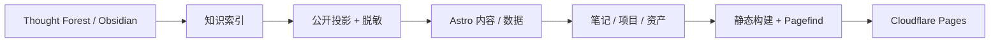

# Digital Biome

> **个人数字花园、项目作品集与持续演进的基础设施地图。**

<p align="left">
  <strong>语言：</strong> <a href="../../README.md">英文</a> · 简体中文
</p>

<p align="left">
  <a href="https://bakersean.top"><strong>在线网站</strong></a> ·
  <a href="https://bakersean168.github.io/digital-biome/"><strong>项目介绍</strong></a> ·
  <a href="../architecture.md"><strong>系统架构</strong></a> ·
  <a href="https://github.com/BakerSean168/thought-forest"><strong>Thought Forest</strong></a>
</p>

Digital Biome 是我的个人数字空间：它把 **知识库、项目作品集、个人履历、数字资产与基础设施可视化** 放在同一个站点里。内容并不是手工复制到前端，而是由 Thought Forest 作为知识真值源，经同步、脱敏、索引和构建流程，把适合公开的部分投影到 Web。

它既是一个 Astro 网站，也是一个关于“如何把个人知识与工程实践组织成长期可维护数字资产”的工程项目。

## 这里包含什么

- **知识花园** —— Obsidian / Thought Forest 笔记、标签、wikilink、反向链接与全文搜索。
- **项目作品集** —— 以产品问题、核心闭环和工程亮点展示项目，并同时连接 GitHub、项目介绍页和生产环境。
- **个人介绍与履历** —— 个人资料、GitHub 活动、履历与持续学习轨迹。
- **基础设施地图** —— 对公开资产、主机、网络和服务关系进行可视化，同时保留 private/internal 边界。
- **可观测信息** —— 把长期运行的个人服务与数字资产状态汇总到可浏览页面。

## 内容架构



仓库通过 Git submodule 固定 Thought Forest revision，从而保证构建可复现。开发过程中，内容通过与 CI 相同的索引和同步管道重新生成，而不是直接修改自动生成的 `src/data` 输出。

## 项目展示模型

`/dev` 页面消费 Thought Forest 中 **公开的 `asset_type: project` 记录**。一个重点项目可以暴露三个职责不同的入口：

1. **在线产品** —— 真正运行中的生产应用。
2. **项目介绍页** —— 基于 GitHub Pages 的轻量介绍站，重点解释产品故事和工程亮点。
3. **GitHub** —— 源码、文档、历史记录与可验证工程证据。

这样可以把已部署服务、源码仓库和作品集展示分离，而不是把它们当成同一个资产。

## 技术栈

- **框架：** Astro 5
- **语言：** TypeScript
- **样式：** Tailwind CSS 4
- **搜索：** Pagefind
- **内容源：** Obsidian + Thought Forest
- **部署：** Cloudflare Pages + Pages Functions
- **访问边界：** Cloudflare Access 保护受限运行面
- **自动化：** GitHub Actions + Wrangler

## 快速开始

### 环境要求

- Node.js 22+
- pnpm 10+
- 支持 submodule 的 Git

### 本地开发

```bash
git clone --recurse-submodules https://github.com/BakerSean168/digital-biome.git
cd digital-biome
pnpm install
cp .env.example .env
pnpm dev
```

常用命令：

```bash
pnpm sync               # 重建 Thought Forest 索引并同步内容
pnpm check              # Astro 类型 / 内容检查
pnpm check:edge         # Pages Functions 类型检查
pnpm test:unit
pnpm test:edge
pnpm test:infrastructure
pnpm build              # sync + Astro + Pagefind + postbuild
```

## 仓库结构

```text
src/
├── pages/              Astro 路由
├── components/         项目、资产、笔记与仪表盘 UI
├── data/               自动生成的公开内容 / 索引投影
├── domain/             笔记路由与基础领域规则
├── repositories/       资产 / 知识索引访问
└── view-models/        展示层适配器

functions/              Cloudflare Pages Functions
scripts/                同步、索引、部署与校验工具
thought-forest/         固定 revision 的知识源 submodule
docs/                   架构与运维文档
```

## 生产与部署

线上网站：**[bakersean.top](https://bakersean.top)**，部署在 Cloudflare Pages。

生产部署刻意保留公开与私有边界：公开静态内容在构建阶段生成，受保护的 `/api/private/*` 能力由 Pages Functions 与 Cloudflare Access 处理。部署工作流使用显式 production 审批和 Wrangler 直接上传，而不是让隐式 Git 集成成为生产真值源。

相关文档：

- [`docs/architecture.md`](../architecture.md) —— 当前系统架构。
- [`docs/cloudflare-deployment.md`](../cloudflare-deployment.md) —— Cloudflare 部署契约。
- [`docs/development-deployment-operations.md`](../development-deployment-operations.md) —— 开发与生产运维。
- [`docs/asset-architecture.md`](../asset-architecture.md) —— 资产模型与可见性边界。

## 与 Thought Forest 的关系

Thought Forest 持有规范化的知识和资产元数据；Digital Biome 负责公开展示和运行时行为。

这种分离是有意设计的：

- 即使没有网站，知识仍然可以在 Obsidian 中独立使用；
- 网站可以从固定的知识 revision 重新构建；
- private/internal 资产元数据可以留在公开输出之外；
- 项目卡可以持续演进，而不需要在前端代码中复制项目事实。

## 仓库状态与许可

Digital Biome 是一个 **公开源码仓库**，但当前 **没有附带开源许可证**。仅公开可见并不代表授予复制、修改或再分发代码的许可；除非未来明确加入许可证，否则版权仍由仓库所有者保留。
